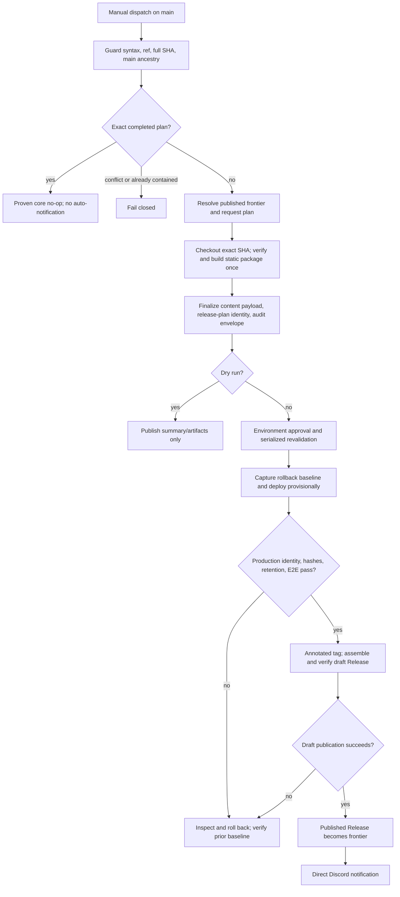

# BugDrop Weekly Manual Release Implementation Plan

Status: Proposed for implementation after specification approval

Specification: `T002-release-cadence-spec.md`, approved by T013

Repository basis: `mean-weasel/bugdrop@12b139c49b157a0decf5570c723fe2935149e5f4`

Scope of this document: repository work, operator configuration, validation, and cutover sequencing; no implementation or external mutation is performed here

## Target Architecture

### Architecture delta

| Concern | Current main | Target state |
| --- | --- | --- |
| Production trigger | Every push to `main` in `.github/workflows/deploy.yml` | `workflow_dispatch` only; normal weekly and emergency releases use the same path |
| Release authority | Conventional commit analysis by semantic-release | Maintainer-selected immutable main-history SHA, explicit bump, readiness summary, and protected approval |
| Release tooling | Workflow and product share one checkout | Immutable trusted controller SHA supplies release logic/config; separate candidate checkout supplies only selected product source/dependencies |
| Version frontier | Local tags and `git describe` | Highest consistent published stable GitHub Release reachable from the candidate, with partial tags/drafts tracked separately |
| Build identity | Production build infers the newest tag | Request identity before build; deterministic release-plan identity after static hashes and Worker inputs exist |
| Static assets | Current version rebuilt during deploy; old exact files disappear | Candidate static package built once; retained exact assets restored from checksum-verified GitHub Release assets |
| Worker integrity | Wrangler bundles whichever checkout the job has | Exact target checkout, lockfile, pinned Wrangler/configuration digest, `BUILD_SHA`, and production health proof |
| Approval and serialization | None | `production` GitHub Environment plus `bugdrop-production-release`, `queue: max`, and no in-progress cancellation |
| Failure order | Publish, deploy, then live-test | Plan, verify, approve, capture baseline, provisional deploy, verify live, assemble/publish Release, notify |
| Recovery | Red run may already have effects | Authoritative state inspection, verified rollback, deterministic resumption, and explicit ambiguous-cancellation handling |
| Notification | Assumed `release.published` child workflow | Direct reusable invocation after matching published Release; notification-only retry remains separate |
| Public history | GitHub Releases plus stale package/changelog claims | GitHub Releases/tags canonical; package version is a development sentinel and changelog is explicitly historical |

### Target release state machine



### Identity and evidence objects

Implementation must use versioned JSON schemas and canonical UTF-8 serialization with recursively sorted keys, normalized line endings, and no implicit current clock.

1. `request-plan.json` contains normalized dispatch inputs, exact repository/workflow ref, immutable controller SHA, candidate target/main/frontier SHAs, previous/next tags, compare/PR inventory, notes, deterministic timestamp inputs, and a request identity. It exists before build.
2. `release-content.json` contains only deterministic content: request identity, static package/file hashes, manifest hash, controller/candidate source and lockfile digests, pinned controller esbuild/Wrangler versions, effective staging/configuration digests, and verification-contract version/result.
3. `release-plan.json` contains `sha256(canonical release-content.json)` as the release-plan identity. It must not contain that identity inside the hashed payload.
4. `audit-envelope.<run>-<attempt>.json` references the release-plan identity and records run/attempt, artifact IDs/retention, approval, Cloudflare observations, publication, notification, cancellation, and recovery. Execution fields never affect content identity.
5. `checksums.txt` covers every Release asset and every deployed static file using a deterministic order and SHA-256.

The GitHub Actions artifact name must contain the release-plan identity and use a documented retention period long enough to span the normal weekly retry window. A rerun uses the same artifact IDs when available. A new dispatch may claim the same plan only after an exact canonical content/hash reproduction.

### Trusted controller and candidate separation

Every nontrivial job uses two immutable, credential-free checkouts with `persist-credentials: false`:

- The **controller checkout** is pinned to GitHub's immutable workflow/controller SHA (`github.workflow_sha` for a new plan), not the moving `main` ref. It contains the reviewed release helpers, schemas, workflow contracts, canonical production configuration, and pinned release toolchain.
- The **candidate checkout** is pinned to `target_sha` in a different directory. It supplies product `src/`, widget source, `package.json`, and lockfile only. An older main ancestor is not assumed to contain any new release helper, workflow, or hardened production configuration.

GitHub documents `github.workflow_sha` as the commit SHA for the workflow file; the implementation contract must assert it is non-empty/full-length and record it. See [GitHub contexts](https://docs.github.com/en/actions/reference/workflows-and-actions/contexts#github-context).

New-plan planning and content identity record the controller SHA and both checkout tree/lockfile digests. Release helpers execute from the controller checkout and receive the candidate directory as explicit data. Candidate tests may execute only in preflight jobs with no write token or production secret. Candidate lifecycle/release scripts never run in the protected mutation job.

The protected job constructs a fresh immutable staging tree outside both checkouts: verified candidate product source/package metadata plus the audited controller production config and controller-pinned tool binaries. Candidate dependencies are installed without lifecycle scripts if required for bundling; the implementation must prove this supports the current dependency tree. Static building invokes the controller-pinned esbuild against candidate widget source. Wrangler runs from the controller lockfile against the recorded staging tree. The workflow hashes the staging manifest immediately before deploy and never mutates candidate source.

The exact supported Wrangler `--config`/working-directory/module-resolution arrangement remains an Operator WP7 capability gate. If direct separation is unsupported, the implementation may use the described content-addressed staging tree only after a non-production proof shows it bundles candidate source and controller configuration exactly; it may not fall back to running the candidate's deploy script.

For a tag/draft partial retry after `main` has changed, the stored release plan selects its original controller SHA. The current workflow definition remains from protected `main`, verifies that stored controller commit is the recorded main-history commit and that its protocol is supported, then checks out that exact controller to reproduce the plan. It must not silently substitute the current controller. Published completed-plan lookup may use a current backwards-compatible reader because it performs no mutation. Keep compatibility fixtures for every still-resumable protocol; if the stored controller/protocol cannot be authenticated or executed safely, stop in a critical manual-recovery state rather than creating a different identity.

This separation is the **credential isolation** boundary: candidate files and processes never receive `GITHUB_TOKEN` with write scope, Cloudflare credentials, Discord credentials, or environment approval data. Only controller commands named by the workflow receive the minimum secret on the exact step that needs it.

### Workflow job boundaries

The replacement `.github/workflows/deploy.yml` remains the single production owner and uses workflow-level concurrency so the lock covers revalidation through publication and recovery. Planning-only dry runs may queue behind a live release; predictability is more important than saving a few minutes.

| Job | Permissions and secrets | Responsibility |
| --- | --- | --- |
| `guard-and-plan` | `contents: read`; no environment/secrets | Pin controller SHA, validate workflow ref/inputs, authenticate completed plans, inspect authoritative Release/ref state, and calculate the request plan |
| `verify-candidate` | `contents: read`; no environment/secrets | Create controller checkout and candidate checkout, verify candidate/tests, build through controller tooling, stage retained assets, and emit checksums/Worker inputs/final plan/audit artifact |
| `dry-run-summary` | `contents: read`; no environment/secrets | Prove State 2 completed and exit without environment access or mutation |
| `core-release` | `contents: write`; protected `production` environment; environment-scoped Cloudflare and test secrets | Revalidate, capture baseline, deploy exact static package and Worker source, verify production/E2E, publish or roll back, write final audit evidence |
| `notify` | `contents: read`; notification-scoped webhook | Call the shared notification implementation only after an exact published Release result |
| `finalize-cancelled` | `contents: read`; protected production recovery credentials | Best-effort authoritative inspection after cancellation; never claims cleanup is guaranteed |

`core-release` must create both checkouts with `persist-credentials: false`, re-hash them against the plan, and execute only controller paths. Although the job needs `contents: write`, the token is passed to no shell or candidate-SHA code before verified publication steps. No third-party action runs after production credentials or the write token becomes available. Issue and pull-request write permission are absent.

The implementation must recheck the current GitHub Actions concurrency schema in CI. GitHub currently documents `queue: max` as retaining up to 100 pending runs and disallowing its combination with `cancel-in-progress: true`; the contract test must prevent removal of `queue: max` or addition of cancellation. See [GitHub concurrency](https://docs.github.com/en/actions/how-tos/write-workflows/choose-when-workflows-run/control-workflow-concurrency).

## Migration Strategy

### Delivery units

Use three repository pull requests and one operator-controlled cutover:

1. **PR A — production safety freeze.** Stop main pushes from invoking semantic-release or Cloudflare. Leave an explicit manually dispatched “release migration frozen” workflow that cannot mutate production. This is the fastest risk reduction and is independently reversible, but rollback must never restore automatic push deployment.
2. **PR B — release engine and deterministic artifacts.** Add pure/testable release helpers, strict build modes, retention packaging, publication-state modeling, production verification, and unit/contract tests. Keep production disabled.
3. **PR C — guarded workflow and documentation.** Install the full manual workflow, reusable live-test/Discord paths, metadata cleanup, operator runbook, and a repository-variable kill switch defaulting off.
4. **Operator cutover.** Configure environments/rules/secrets, validate Cloudflare rollback capability, run dry/failure drills, enable the kill switch, and perform one supervised bootstrap release.

Every PR must pass the existing merge queue. PR B and PR C may be stacked for review, but PR C must not merge until PR B is on `main`; neither can restore an automatic production trigger.

### Non-negotiable migration gates

- No production release is possible between PR A and successful operator cutover except an explicitly documented manual Cloudflare recovery action.
- `RELEASE_PRODUCTION_ENABLED` is absent/`false` by default. The workflow always allows State 2 dry runs; a live request fails before environment/secrets unless the variable is exactly `true`.
- The installed Wrangler version and Cloudflare account must prove version inspection and rollback behavior before live enablement. Help text is not proof; use a non-production deployment and rollback/readback drill.
- The first production release uses the bootstrap baseline because current health omits `buildSha` and reports `development`.
- Routine rollback freezes releases and restores the previous Cloudflare version; it never reintroduces push-triggered release or moves/deletes a tag.

## Repository Change Inventory

### Existing files to modify

| File | Planned change |
| --- | --- |
| `.github/workflows/deploy.yml` | PR A freezes the old path; PR C replaces it with dispatch-only guarded state machine, concurrency, permissions, environment, artifacts, publication, recovery, and direct notification dependency |
| `.github/workflows/live-tests.yml` | Add explicit release-call inputs for SHA, version, widget origin/hash, exact URL, and manifest hash; remove production reliance on `git describe`; preserve scheduled monitoring and preview behavior |
| `.github/workflows/discord-release.yml` | Add `workflow_call`; remove reliance on `release.published`; preserve manual tag retry/dry run and bounded custom fields |
| `.github/workflows/ci.yml` | Stop preview build identity from using the latest tag; pass explicit development/preview identity while preserving preview deployment and merge-queue checks |
| `test/ci-workflow-contract.test.sh` | Preserve existing preview assertions and add production trigger, ref guard, permissions, environment, concurrency, ordering, explicit live identity, and notification contracts |
| `scripts/build-widget.js` | Introduce strict release/development modes, validate stable SemVer in release mode, require deterministic timestamp input, emit only declared outputs, and never fall back to package version for production |
| `package.json` | Remove semantic-release, set documented development sentinel, add release-helper/test scripts; retain commitlint because commit style may remain without release authority |
| `package-lock.json` | Lockfile update caused only by semantic-release removal and any explicitly approved test/runtime dependency |
| `knip.json` | Remove semantic-release ignore entries and add new release helper entry points |
| `Makefile` | Add deterministic release-plan/build/contract targets; make production build require explicit inputs while keeping local development simple |
| `wrangler.toml` | Add explicit `[env.production]` name/routes/vars as applicable; production workflow still passes `BUILD_SHA`; keep preview config behavior unchanged |
| `src/routes/api.ts` | No semantic change expected: retain existing optional `buildSha`; change only if implementation needs stricter production validation surfaced by tests |
| `test/api.test.ts` | Add/retain proof that production health reports exact `environment` and `buildSha`; do not make development/preview behavior regress |
| `CHANGELOG.md` | Mark entries through 1.11.0 as historical and link GitHub Releases as canonical current history; do not resume per-release commits |
| `CLAUDE.md` | Replace semantic-release/conventional-bump guidance with manual weekly release/runbook guidance while retaining conventional commits as a collaboration convention |
| `docs/website/version-pinning.mdx` | Explain prospective exact-asset retention boundary and never claim unavailable historical bytes |

### New repository files

| File | Responsibility |
| --- | --- |
| `.github/release.yml` | Generated Release-note categories/exclusions while preserving an unfiltered compare/PR inventory in provenance |
| `scripts/release/canonical-json.mjs` | Canonical serialization and SHA-256 primitives; no GitHub or clock access |
| `scripts/release/plan.mjs` | Input/ref/source/controller validation, completed-plan lookup, frontier/partial-state modeling, SemVer calculation, request plan, and stale revalidation; API/state adapters injectable for tests |
| `scripts/release/static-assets.mjs` | Controller-driven candidate build orchestration, prior Release-asset download/checksum validation, retained tree/aliases/manifest creation, tar/archive validation, and checksums |
| `scripts/release/publication.mjs` | Inspect annotated tag/draft/published states, create identity-bound annotated tag/draft, reconcile exact assets, read-verify completeness, and final publish |
| `scripts/release/production-state.mjs` | Normalize Cloudflare version/deployment observations, capture bootstrap/normal baselines, verify candidate or prior baseline, and emit recovery evidence; exact CLI adapter added only after capability proof |
| `scripts/release/verify-live.mjs` | Poll health, latest/exact/aliases/retained hashes, and manifest against explicit plan inputs; no `git describe` or mutable-main inference |
| `scripts/discord-release.mjs` | Extract and test existing release lookup, payload, allow-listed mention, dry-run, and webhook behavior for both reusable and manual workflows |
| `test/release/canonical-json.test.ts` | Canonicalization, identity sensitivity/exclusions, and no-self-reference tests |
| `test/release/plan.test.ts` | Source/ref/controller/frontier/completed-plan/partial-state/SemVer/stale/concurrent/idempotency tables |
| `test/release/static-assets.test.ts` | Release/dev build modes, deterministic manifest, retention, corruption, expiry/rebuild, aliases, hooks, and archive tests |
| `test/release/publication.test.ts` | No-tag, tag-only, draft, partial assets, published, lost-response, and every conflict transition |
| `test/release/production-state.test.ts` | Bootstrap/normal baseline, ambiguous deploy result, rollback verification, and cancellation state tests with fixtures |
| `test/release/verify-live.test.ts` | Health/SHA/hash/manifest/retention success and mismatch tests |
| `test/release-workflow-contract.test.sh` | Dedicated manual-release workflow syntax/trigger/permission/environment/concurrency/dependency/secret/order contract |
| `test/fixtures/release/*.json` | Sanitized GitHub/Cloudflare/manifest state fixtures; never real tokens or private payloads |
| `docs/releasing.md` | Weekly/emergency operator runbook, terminal-state decision table, rollback/cancellation recovery, notification-only retry, and evidence checklist |

Do not add generated `public/widget*.js`, `versions.json`, workflow artifacts, Cloudflare state, tokens, or real production responses to git.

## Work Package 0 — Freeze Automatic Production

**Objective:** make merges incapable of releasing or deploying before the larger migration lands.

**Dependencies:** none.

**Allowed scope:** `.github/workflows/deploy.yml`, `test/release-workflow-contract.test.sh`, and the test target registration in `Makefile`/`package.json` if required.

**Changes:**

1. Replace `on.push.branches: [main]` with `workflow_dispatch` only.
2. Replace semantic-release/deploy/live jobs temporarily with one read-only freeze job that explains the migration and exits without checking out target code, using secrets, creating tags/Releases, or invoking Wrangler.
3. Add a contract test proving there is no `push`, `pull_request`, `merge_group`, `release`, or `schedule` production trigger and no semantic-release/Wrangler production command.
4. Keep preview CI, scheduled live monitoring, and docs sync untouched.

**Verification:**

```sh
bash test/release-workflow-contract.test.sh
bash test/ci-workflow-contract.test.sh
npm run check:actions-node24
git diff --check
```

After merge, inspect the Actions workflow trigger and merge a documentation-only canary PR; prove no Deploy run starts. Do not trigger a production deploy merely to test absence.

**Failure handling:** if workflow validation fails, keep the existing PR unmerged. If an unexpected production run starts after merge, cancel it before deployment if possible, set the repository kill switch false/absent, inspect Cloudflare state, and follow the existing-state recovery checklist.

**Rollback:** revert only the malformed freeze implementation to a corrected manual no-op workflow. Never restore `push` production deployment.

**Exit proof:** AC-01, AC-02, and preservation half of AC-22 pass before starting engine work.

## Work Package 1 — Deterministic Planning and Identity Engine

**Objective:** implement all read-only decisions as testable Node modules before wiring production.

**Dependencies:** WP0 merged.

**Allowed scope:** `scripts/release/canonical-json.mjs`, `scripts/release/plan.mjs`, `test/release/canonical-json.test.ts`, `test/release/plan.test.ts`, fixtures, `.github/release.yml`, `package.json`, `Makefile`, and `knip.json`.

**Changes:**

1. Define versioned schemas for normalized dispatch fields, request plan, release content, final plan, audit envelope, and publication marker.
2. Resolve and record immutable controller SHA from the workflow context before either checkout. Reject non-main workflow refs; validate exactly 40 lowercase hex characters, fetch remote main/tags/Releases, and use `merge-base --is-ancestor` against `origin/main` for candidate and required controller/history checks.
3. Model published Releases, resolved refs, orphan/lightweight/annotated tags, drafts, and target ancestry separately.
4. Perform completed-plan lookup before frontier calculation. Verify downloaded plan/content/checksum assets and tag marker; exact match yields a typed no-op, while changed/same/contained targets fail.
5. Calculate the published frontier and explicit patch/minor/major result without conventional commit analysis. Never silently increment past a partial next tag.
6. Query the compare/PR data, retain a complete unfiltered list, generate categorized notes, and record excluded newer-main commits.
7. Produce deterministic request identity, content identity, and separate audit envelope, including controller/candidate provenance without execution fields. Inject clocks/API adapters; pure identity code must never read `Date.now()`, environment run IDs, or artifact IDs.
8. Implement stale revalidation for frontier/tag/draft/main changes after queue wait and stored-controller selection for a recognized partial plan.

**Tests and verification:**

```sh
npx vitest run test/release/canonical-json.test.ts test/release/plan.test.ts
node scripts/release/plan.mjs --help
npm run typecheck
npm run lint
npm run knip
git diff --check
```

Table tests must include valid tip/older main ancestor whose tree lacks all release helpers, abbreviated/mixed-case/unreachable SHA, non-main ref, mutable/wrong controller SHA, empty range, malformed/prerelease/build-metadata tags, divergent Release/ref, orphan tags, drafts, exact completed plan, corrupt/missing identity assets, already-contained SHA, concurrent winner, stale frontier, and a partial plan whose original controller differs from current main.

**Failure handling:** network/API uncertainty is a typed non-mutating failure, never “no releases.” Multiple candidates or inconsistent GitHub objects fail closed and include object IDs/URLs without secrets.

**Rollback:** remove the new unused helpers/tests if abandoned; WP0 remains frozen.

**Exit proof:** AC-03, AC-04, AC-05, AC-06, AC-10, AC-14 planning cases, AC-26, AC-30, AC-31, and AC-32 unit proofs pass.

## Work Package 2 — Deterministic Static Assets and Retention

**Objective:** build one verified static deployment package and make prospective exact URLs durable.

**Dependencies:** WP1 schemas and plan outputs.

**Allowed scope:** `scripts/build-widget.js`, `scripts/release/static-assets.mjs`, related tests/fixtures, `package.json`, `Makefile`, `.github/workflows/ci.yml`, and `test/ci-workflow-contract.test.sh`.

**Changes:**

1. Add explicit build mode and source/output directory arguments so the controller script can build candidate source without importing candidate release code. `release` requires a valid planned stable version and fixed normalized timestamp; `development` uses a visible non-release identity and cannot emit authoritative release metadata.
2. Remove production fallback to `package.json`. Release mode fails for missing/invalid version, missing timestamp, test hooks, unexpected output, or dirty output directory.
3. Build the new widget once with controller-pinned esbuild against the candidate checkout; record exact, latest, major, and minor aliases as byte-identical copies.
4. Download every post-cutover retained exact asset and checksum from its published GitHub Release. Reject missing, duplicate, unexpected, or corrupt assets. Do not represent historical 404 versions.
5. Construct `versions.json` deterministically from the declared cutover boundary and fixed plan values. Package the complete `public/` tree and checksums once for downstream upload/download, Cloudflare deployment, live readback, and Release assets.
6. Define retry semantics: same run uses immutable artifact ID; new dispatch rebuilds only with identical pinned inputs and must reproduce every hash before reuse.
7. Change preview CI from `git describe` to an explicit development identity without changing preview URLs, `BUILD_SHA`, environment polling, exact widget fixture, canary behavior, or required checks. Preview does not need the dual release checkout because it deploys its own merge-group candidate and has no release credentials.

**Tests and verification:**

```sh
npx vitest run test/release/static-assets.test.ts
bash test/ci-workflow-contract.test.sh
BUGDROP_BUILD_MODE=release BUGDROP_VERSION=1.56.0 BUGDROP_RELEASE_TIMESTAMP=2026-08-02T00:00:00Z npm run build:widget
shasum -a 256 public/widget.js public/widget.v1.56.0.js
make check
git diff --check
```

Run the release build twice from clean controller/candidate/staging directories with the same inputs and compare recursive file names/hashes. Use an older candidate fixture that lacks `scripts/release/**` and prove the controller still builds it. Change one timestamp/source/tool/controller input and prove content identity changes. Corrupt one prior asset and prove packaging stops.

**Failure handling:** any missing archive/hash fails before approval. Artifact expiry triggers deterministic rebuild-and-compare or a new plan/approval; it never substitutes bytes.

**Rollback:** revert build-mode changes and keep WP0 frozen. Never cut over exact retention until two-build reproducibility and N/N+1 fixture tests pass.

**Exit proof:** AC-07 build half, AC-08, AC-19, AC-20, AC-21 build half, AC-22 preview proof, and AC-28 pass.

## Work Package 3 — Worker, Live Verification, and Notification Components

**Objective:** make production identity and notification explicit and reusable without yet enabling a release.

**Dependencies:** WP1–WP2.

**Allowed scope:** `wrangler.toml`, `scripts/release/production-state.mjs`, `scripts/release/verify-live.mjs`, `scripts/discord-release.mjs`, related tests, `.github/workflows/live-tests.yml`, `.github/workflows/discord-release.yml`, `src/routes/api.ts`/`test/api.test.ts` only if tests expose a gap.

**Changes:**

1. Pin and record Wrangler/esbuild from the controller lockfile; separately hash the candidate tree/package lock and compute the effective staging/configuration digest.
2. Add explicit controller-owned production configuration and require deploy-time `BUILD_SHA=target_sha` plus `ENVIRONMENT=production`. Prove the staged Wrangler entry point and module resolution use candidate source/dependencies. Do not claim prebuilt Worker byte promotion unless Operator WP7 proves a supported Wrangler mechanism.
3. Implement baseline normalization for current bootstrap state and future identified state. Capture Cloudflare version/deployment ID, live health, widget/manifest/alias hashes, and prior published tag.
4. Implement live verifier inputs for expected SHA, version, origin, widget hash, exact/alias names, retained manifest/hashes, and timeout. It must never call `git describe`.
5. Refactor live-tests workflow calls to require explicit release identity. Scheduled production monitoring observes and reports current live identity without pretending a checkout tag is expected identity. Preview keeps its existing explicit SHA/hash path.
6. Extract Discord payload/send logic. Add `workflow_call` and keep manual tag-scoped dry-run/retry. Remove `release.published` as an automatic authority. Deduplicate automatic sends by release-plan identity/tag.

**Capability gate and verification:**

```sh
npx wrangler --version
npx wrangler deployments --help
npx wrangler versions --help
npx vitest run test/release/production-state.test.ts test/release/verify-live.test.ts
bash test/ci-workflow-contract.test.sh
npm run validate
git diff --check
```

The Wrangler help commands only identify candidate operations. Operator WP7 must prove the exact list/rollback/deploy commands, controller-config/candidate-source staging layout, module resolution, and JSON fields against preview or another non-production Worker using the locked controller version. Record the accepted command shape in `docs/releasing.md`; if no verifiable rollback or checkout separation is available, block cutover.

**Failure handling:** unknown Cloudflare JSON/state returns “ambiguous,” never success. A Discord failure returns a tag-scoped retry instruction and cannot invoke deploy/publication.

**Rollback:** revert component/workflow changes while WP0 remains frozen. Preview and scheduled monitoring must pass their original contracts before merge.

**Exit proof:** AC-11, AC-12, AC-17, AC-18, AC-22, and AC-27 component proofs pass.

## Work Package 4 — Publication and Recovery Engine

**Objective:** implement the post-verification GitHub state machine and compensating recovery as pure/tested transitions.

**Dependencies:** identities/static package from WP1–WP2 and Cloudflare state model from WP3.

**Allowed scope:** `scripts/release/publication.mjs`, publication/production-state tests and fixtures, and runbook draft.

**Changes:**

1. Inspect tag ref/object, tag annotation, draft/published Releases, body marker, target, assets, and checksums before every action.
2. Create a canonical annotated tag only at the target SHA with protocol/version/identity marker; never force, move, or delete it.
3. Create/reuse an identity-matched draft. Reconcile only absent exact assets, reject name/hash/content conflicts, download/read-verify the complete required set, then publish the draft explicitly.
4. Treat published exact match as no-op. Treat lightweight orphan, wrong SHA/identity, unrelated draft, duplicate Release, unexpected asset, or published mismatch as conflict.
5. Model lost responses for every mutation by re-reading authoritative state.
6. Emit typed outcomes consumed by the workflow: `published`, `already-published`, `partial-resumable`, `conflict`, or `unknown-critical`.

**Tests and verification:**

```sh
npx vitest run test/release/publication.test.ts test/release/production-state.test.ts
npm run typecheck
npm run lint
git diff --check
```

Use a fake GitHub adapter that can apply a mutation and then throw to simulate lost responses. Assert the second attempt never duplicates, overwrites, moves, deletes, or increments.

**Failure handling:** before publication, deployment is provisional. A publication failure triggers prior-baseline rollback handling; identity-matched partial GitHub objects remain for exact retry. A published matching result wins over a lost client response and must not be rolled back as unpublished.

**Rollback:** helpers are unused until WP5; remove them if necessary. Never “clean up” test-discovered production tags.

**Exit proof:** AC-13, AC-14, AC-16, AC-30, and AC-31 transition proofs pass.

## Work Package 5 — Full Manual Workflow and Contracts

**Objective:** replace the freeze with the complete workflow while production remains killed off.

**Dependencies:** WP1–WP4 green; T013 spec unchanged.

**Allowed scope:** `.github/workflows/deploy.yml`, release/live/Discord workflows, release scripts/tests, workflow contract tests, `Makefile`, and package scripts.

**Changes:**

1. Add only the specified dispatch inputs and an immediate `github.ref == refs/heads/main` guard.
2. Pin `controller_sha` from immutable workflow context. Set workflow-level `contents: read`; declare `bugdrop-production-release`, `queue: max`, and `cancel-in-progress: false`.
3. Implement the target jobs and immutable artifact handoffs. Every job creates separate controller and candidate checkouts at explicit SHAs; no job checks out mutable main or executes candidate release helpers.
4. `dry_run=true` completes State 2 and never references `production`, secrets, Cloudflare, tag/Release write, or Discord.
5. A live run additionally requires `vars.RELEASE_PRODUCTION_ENABLED == 'true'`, then protected environment approval and stale/completed-plan revalidation.
6. In `core-release`, recreate both credential-free checkouts, download/hash-check the static package, verify controller/candidate/staging digests, capture baseline, and invoke controller-pinned Wrangler once against the immutable candidate-source staging tree.
7. Run explicit live verification/E2E before any GitHub publication. On deploy/verify/publication failure, inspect state, attempt the validated rollback, and verify the complete bootstrap/normal baseline.
8. Publish through WP4 only after live success. Pass write token only to named controller publication steps; neither checkout persists credentials and no candidate command receives any secret.
9. Notify directly only for a newly/matchingly published core result. Exact post-success and concurrent-winner no-ops do not auto-notify.
10. Add `always()` finalization for mutation attempts, explicitly labeling cancellation cleanup best effort and ambiguous states critical.

**Contract verification:**

```sh
bash test/release-workflow-contract.test.sh
bash test/ci-workflow-contract.test.sh
npm run check:actions-node24
npm run validate
make build-all
git diff --check
```

Parse the workflow with an Actions-aware YAML/schema checker. The contract must assert triggers, input types/default, main-ref guard before checkout, immutable workflow/controller SHA, distinct controller/candidate paths and refs, `persist-credentials: false`, full candidate SHA validation, workflow-level queue, job permissions, no issue/PR write, environment only on mutation/recovery jobs, kill switch, dependency ordering, credential isolation from candidate commands, no `git describe`, explicit live inputs, no release-event notification dependency, and rollback/finalization conditions.

**Failure handling:** workflow syntax or contract failure blocks merge. A merged but disabled workflow can be reverted to the WP0 manual freeze without restoring automatic deployment.

**Rollback:** set/keep `RELEASE_PRODUCTION_ENABLED=false` first, then revert to freeze. Do not use a workflow revert as service rollback; use the recorded Cloudflare baseline.

**Exit proof:** repository-side AC-01 through AC-18 and AC-22 through AC-32 pass; external and production proofs remain pending Operator WP7–WP8.

## Work Package 6 — Metadata, Documentation, and Dependency Cleanup

**Objective:** remove semantic-release authority and make operator/public documentation truthful.

**Dependencies:** WP5 workflow contracts.

**Allowed scope:** `.releaserc.json` deletion; `package.json`, lockfile, `knip.json`, `CLAUDE.md`, `CHANGELOG.md`, `docs/releasing.md`, `docs/website/version-pinning.mdx`, and relevant tests.

**Changes:**

1. Remove `semantic-release` and its lockfile graph; delete `.releaserc.json` and knip exceptions.
2. Set `package.json` to an explicit documented development sentinel that cannot be parsed as a production release. Production build ignores it and requires planned version.
3. Keep conventional commit linting only as a readability convention; remove statements that commit prefixes choose releases.
4. Mark changelog historical and link canonical GitHub Releases.
5. Document exact URL retention as prospective from the recorded cutover tag; disclose unavailable historical files and provenance-only backfill rules.
6. Complete `docs/releasing.md` with weekly/emergency preparation, dry run, approval, live run, terminal-state matrix, cancellation, rollback, notification-only retry, and evidence capture.

**Verification:**

```sh
rg -n 'semantic-release|git describe' .github scripts package.json package-lock.json knip.json CLAUDE.md CHANGELOG.md docs test || true
npm ci
make check
npm test
git diff --check
```

Expected remaining matches must be historical/migration explanation or negative contract assertions, not executable release authority.

**Failure handling:** dependency/lockfile or documentation inconsistency blocks PR C. Do not re-add semantic-release to work around a manual-workflow defect.

**Rollback:** revert metadata/docs together with WP5 only while production remains disabled. If already cut over, freeze and fix forward; never reinstate automatic releases.

**Exit proof:** AC-20, AC-21, AC-24, and AC-25 repository portions pass.

## External Configuration

External mutations happen only after PR C is merged and repository tests are green. Capture screenshots or API JSON with secret values redacted and attach them to the cutover record.

### Operator Work Package 7 — Protected production and rollback capability

**Objective:** establish audited GitHub authority and prove Cloudflare rollback without enabling production.

**Dependencies:** WP0–WP6 merged and green.

**Rollback:** keep `RELEASE_PRODUCTION_ENABLED=false`, remove or correct incomplete environment/ruleset configuration, and leave the manual workflow disabled. Never compensate by weakening approval or restoring push deployment.

### GitHub configuration

1. Create environment `production` with deployment branch `main`, required reviewer(s), administrative bypass disabled, and self-review prevention when two maintainers are eligible. Document a named exception if only one is eligible.
2. Move `CLOUDFLARE_API_TOKEN`, `CLOUDFLARE_ACCOUNT_ID`, and any production live-test secret into the environment. The token must be least-privilege for this Worker/account.
3. Put `DISCORD_RELEASE_WEBHOOK_URL` in a notification-appropriate environment/secret scope that supports both direct call and manual notification-only retry without exposing Cloudflare credentials.
4. Create repository variable `RELEASE_PRODUCTION_ENABLED=false`.
5. Confirm default `GITHUB_TOKEN` is read-only. Workflow job permissions supply `contents: write` only to `core-release`; no issues/PR write.
6. Add a tag ruleset for `v*` that prevents update/deletion and restricts creation to the approved release workflow/integration. Prove the workflow can create a test tag in a disposable repository or documented non-production namespace before relying on the rule. Do not create a production SemVer tag for testing.
7. Confirm merge queue and required checks are unchanged. Record the exact check names used by candidate readiness validation.
8. Confirm environment deployment history appears for the dry-run-disabled test only after approval; dry runs must create no deployment record.

### Cloudflare capability proof

Using the locked Wrangler version and a preview/disposable Worker:

1. Record `npx wrangler --version` and the exact commands/options that list deployments/versions and return machine-readable IDs.
2. From two separate immutable checkouts, construct the planned controller-config/candidate-source staging tree. Deploy known candidate source/static hash A with explicit environment/SHA using controller Wrangler, prove live code/assets came from the candidate rather than controller, record its version/deployment ID, then deploy B.
3. Invoke the candidate rollback mechanism to A. Verify API health identity, latest/static exact hashes, manifest, and aliases all return A's recorded values.
4. Simulate a deploy command that loses its response if feasible; prove authoritative inspection distinguishes A, B, and unknown state.
5. Confirm assets participate in version rollback as assumed. If Worker code rolls back but assets do not, design and test an explicit checksum-verified static restoration before cutover.
6. Put the exact accepted commands, expected JSON fields, timeouts, and manual fallback in `docs/releasing.md` and fixtures. Do not encode a guessed command.

If any capability is absent or unstable, keep the kill switch false and revise the implementation/spec; this is a cutover blocker, not a reason to weaken verification.

## Verification Program

### Repository test layers

1. **Pure unit tests:** canonical identity, SemVer/frontier, completed-plan lookup, static manifests, state transitions, payload formatting.
2. **Workflow contracts:** triggers, scopes, environments, concurrency, dependencies, explicit inputs, and forbidden strings/commands.
3. **Adapter integration tests:** sanitized GitHub and Cloudflare fixtures, lost-response behavior, artifact corruption/expiry.
4. **Dry-run Actions tests:** main and temporary-branch refs, tip and older main ancestors, weekly/emergency inputs, concurrent dispatches.
5. **Non-production deployment drills:** Worker identity, static package promotion, rollback, retained N/N+1 assets, ambiguous cancellation.
6. **Production cutover proof:** supervised bootstrap baseline, exact candidate verification, publication, notification, and follow-up monitoring.

### Required scenario matrix

| Scenario | Expected result |
| --- | --- |
| Dispatch workflow file from non-main ref | Fails before candidate checkout, artifacts, environment, or secrets |
| Invalid/branch/abbreviated/unreachable target | Read-only failure |
| Older releasable main ancestor | Plan lists every excluded newer-main commit and may proceed only after approval |
| Older main ancestor lacks release helpers/config | Controller checkout supplies all release logic/config; candidate checkout supplies only product source; hashes and live SHA prove the separation |
| No commits after frontier | No-op-range failure unless exact completed-plan lookup succeeds |
| Dry run | State 2 artifacts/summary; zero environment/deploy/tag/Release/notification effects |
| Two plans for same next version | Queue retains both; winner publishes, loser exact-no-ops or fails stale/conflict without increment |
| Same run rerun | Reuses immutable artifacts and resumes missing state |
| Partial retry after controller changed | Uses authenticated stored controller SHA/protocol or stops critical; never substitutes current controller into the old identity |
| Expired artifacts | Deterministic rebuild must match identity or require new approval |
| Wrong tag/draft/asset | Fails closed; no overwrite/delete/increment |
| Deploy command error/lost response | Inspect Cloudflare; rollback if candidate/partial is active |
| Live identity/hash/E2E failure | Verify rollback baseline; no published Release/notification |
| Publication lost response | Inspect exact tag/draft/published state; resume or recognize success without duplication |
| Discord failure | Core release remains; explicit notification-only retry succeeds |
| Cancellation after mutation | Best-effort finalizer; otherwise critical ambiguous state and manual inspection |
| Candidate script attempts credential access | Contract and instrumented fixture prove no write/Cloudflare/Discord secret is present in the candidate process environment |
| Exact post-success rerun | Authenticated core no-op before advanced-frontier calculation and no auto-notification |
| Same target with changed inputs / target contained later | Fail closed; never another version |

## Rollout

### Operator Work Package 8 — Dry run, supervised cutover, and observation

**Objective:** enable the proven system through one bootstrap release and one N+1 retention proof.

**Dependencies:** Operator WP7 evidence accepted.

**Rollback:** immediately set the kill switch false and follow the service/automation recovery sections below; do not move tags or restore semantic-release.

### Pre-cutover checklist

1. PR A, PR B, and PR C are merged through the queue; `main` has no automatic production trigger.
2. Full repository suite and workflow schema/contracts pass from clean install.
3. T013-approved specification still matches the implementation; any semantic change returns to spec review.
4. GitHub production environment, reviewers, branch policy, secret scope, token permissions, tag rules, and false kill switch are evidenced.
5. Wrangler/Cloudflare version and rollback drill passes, including static assets.
6. Choose and record the weekly window, reviewer, first target SHA, explicit bump, and retention cutover version.
7. Capture bootstrap production baseline: Cloudflare ID, live health JSON, current GitHub tag/Release, latest/exact/alias/manifest hashes, and known historical 404 boundary.

### Dry-run sequence

1. Dispatch from `main` with the selected target, bump, `weekly`, `dry_run=true`, and reviewed notes.
2. Review included/excluded PRs, current-main delta, next version, deterministic timestamp, static/checksum set, Worker input digest, and final release-plan identity.
3. Confirm the summary shows distinct immutable controller and candidate SHAs/tree/lockfile digests. For an older-ancestor dry-run fixture, prove missing candidate release helpers are never invoked.
4. Prove the run has no environment deployment, secrets, tag/draft/Release, Cloudflare version, or Discord call.
5. Repeat the same dry run and prove identical content identity with a distinct audit envelope.
6. Run negative branch, stale plan, emergency-without-rationale, conflicting artifact, wrong-controller, and credential-canary fixtures.

### Bootstrap production release

1. Set `RELEASE_PRODUCTION_ENABLED=true` only during the staffed window.
2. Dispatch the exact approved inputs from `main`; a second maintainer reviews the finalized plan and hashes in the environment gate.
3. Watch baseline capture, provisional deploy, health/static/manifest/retention polling, and live E2E.
4. Verify annotated tag, complete draft assets, final publication, and direct Discord result.
5. Download Release assets independently and compare checksums. Query live health and all aliases/exact URL independently.
6. Record the cutover version as the prospective retention boundary and store the final audit evidence.
7. Run an exact post-success dispatch and prove it core-no-ops without approval/deploy/notification.

### Observation window

Keep the release system under heightened observation for seven days and through the next weekly release:

- daily scheduled live monitor remains green;
- no push-triggered Deploy runs exist;
- production health stays `production` with the released SHA;
- exact/alias/manifest hashes remain correct;
- Release/tag/assets and deployment records remain consistent;
- a second release proves N exact assets survive N+1;
- notification-only retry is tested with dry run, not a duplicate live post.

After the second successful weekly release, keep the kill switch as an emergency freeze control and close the migration record. Do not add a schedule trigger to the production workflow.

## Rollback and Recovery

### Service rollback

1. Set `RELEASE_PRODUCTION_ENABLED=false` to prevent another live dispatch.
2. Resolve the exact candidate and recorded prior baseline from the run audit.
3. Inspect authoritative Cloudflare state; do not infer state from the failed command exit code.
4. Use the proven rollback mechanism to restore the recorded prior deployment/version and, if required, static asset package.
5. Verify the full bootstrap or normal baseline, including Cloudflare ID, health, widget/manifest/alias hashes, and later `buildSha`/tag.
6. Leave matching partial annotated tag/draft objects intact for deterministic resumption. Do not move/delete tags.

### Automation rollback

If the repository workflow itself is defective, keep production disabled and revert PR C to the WP0 freeze or issue a fix-forward PR. A workflow rollback never implies the service rolled back. Never restore semantic-release or a main-push deploy as an emergency shortcut.

### Terminal-state ownership

| State | Operator action |
| --- | --- |
| Preflight/candidate failure | Fix source/input and dispatch a new dry run; no external recovery |
| Approval rejected/stale | Replan; never approve/recalculate in place |
| Deploy/verify failure with verified rollback | Keep disabled, correct cause, reproduce same plan or create new approved plan |
| Rollback unverified | Incident/critical state; inspect Cloudflare and live hashes until one baseline is proven |
| Tag-only or draft partial after rollback | Same version/identity may resume after re-deploy/verify; no tag deletion |
| Matching published Release after lost response | Treat core as published; do not roll back or republish; continue notification if needed |
| Discord failure | Use manual notification-only tag path; no core rerun |
| Cancellation after mutation | Do not trust “cancelled”; run authoritative inspection and recovery checklist |

## Operator Runbook

The final `docs/releasing.md` should use this compact weekly flow:

1. Choose a full SHA from GitHub `main` history only after the intended PR stack is coherent.
2. Choose explicit bump; use `weekly` normally or `emergency` with mandatory rationale.
3. Run dry mode and review included/excluded work, version, hashes, Worker inputs, and plan identity.
4. Re-dispatch live with exactly the reviewed fields during the window.
5. Approve only the finalized post-build plan in `production`; reject if main/frontier/content differs.
6. Observe provisional identity and publication. On any critical/ambiguous result, freeze and inspect before retrying.
7. Confirm GitHub Release, live health/hash/manifest/exact URLs, Discord result, and audit envelope.
8. For notification failure, run Discord workflow by published tag. For service failure, use rollback—not tag mutation.

Emergency releases differ only in timing and mandatory rationale; they never bypass dry run, environment approval, serialization, verification, identity, retention, publication, or recovery.

## Traceability

| Acceptance criterion | Implementation and proof |
| --- | --- |
| AC-01–02 | WP0/WP5 trigger contract and post-merge Actions audit |
| AC-03–04 | WP1 ref/full-SHA/controller/ancestry tests plus real non-main and older-ancestor dry runs |
| AC-05 | WP1 summary fixture and environment approval evidence |
| AC-06 | WP1 published-frontier/SemVer table tests |
| AC-07 | WP2/WP5 State 2 dry run and zero-effect audit |
| AC-08 | WP2 package hashes across build, artifact, deploy, live, and Release |
| AC-09 | WP5 workflow contract plus GitHub environment/concurrency audit |
| AC-10 | WP1/WP5 concurrent dispatch and stale revalidation drill |
| AC-11–12 | WP3 explicit health/SHA/hash verifier and live workflow contract |
| AC-13 | WP4/WP5 order contract and forced live failure |
| AC-14 | WP4 tag/draft/published transition table and immutable tag rules |
| AC-15 | WP3, Operator WP7, and Operator WP8 bootstrap/normal rollback drills |
| AC-16 | WP4 lost-response simulations and cutover failure injection |
| AC-17–18 | WP3 direct reusable Discord call and notification-only retry |
| AC-19 | WP2 fixture plus N/N+1 production observation |
| AC-20 | WP2/WP6 manifest boundary and public documentation |
| AC-21 | WP2/WP6 strict release build and metadata inspection |
| AC-22 | Existing CI contract plus trigger/diff audit after every PR |
| AC-23 | WP5 controller/candidate credential-isolation contract and GitHub settings audit |
| AC-24 | WP1/WP5 emergency validation and dry-run fixture |
| AC-25 | WP6 runbook review and Operator WP8 terminal-state exercises |
| AC-26 | WP1 lifecycle/identity timing tests and approval summary |
| AC-27 | WP3 controller/candidate source/lock/tool/config/staging digest and live `BUILD_SHA` proof |
| AC-28 | WP2 available/expired artifact retry tests |
| AC-29 | WP5 cancellation drill, best-effort finalizer, and manual recovery evidence |
| AC-30 | WP1 canonical content/audit exclusion and two-dispatch tests |
| AC-31 | WP1/WP4 tag-only/partial-draft same-version retry tests |
| AC-32 | WP1/WP5 exact post-success no-op and changed/contained negative tests |

## Definition of Done

Implementation is complete only when all of the following are true:

1. Repository search finds no executable semantic-release authority, production `git describe`, or automatic production trigger.
2. Clean-install repository checks, unit tests, workflow schema/contracts, builds, and existing preview/live contracts pass, including an older main ancestor with no release helpers and an instrumented candidate credential-isolation fixture.
3. Every AC-01 through AC-32 has the cited automated or operator evidence; no production-only criterion is marked complete from a mock alone.
4. GitHub environment, reviewers, token/secret scopes, concurrency, tag rules, and kill switch are independently audited.
5. The locked Wrangler/Cloudflare rollback mechanism is proven against real non-production state and recorded in the runbook.
6. A real dry run proves State 2 and zero external mutation.
7. The supervised bootstrap release proves target SHA, production environment, static hashes, prospective retention, complete publication, direct notification, and post-success no-op.
8. A verified rollback drill exists for both bootstrap and normal identified baselines, or cutover remains disabled.
9. The next weekly release proves the previous exact asset survives unchanged.
10. Only then may the migration record close. Weekly remains a human cadence; no timer publishes production.

The strongest realistic failure mode is a command/API failure after provisional production mutation but before a complete published Release. The implementation is not done until a failure-injection trace proves authoritative state inspection, exact prior-baseline restoration or exact matching publication recognition, no version drift, no duplicate notification, and no tag move/delete at every boundary.
